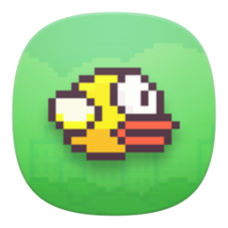

	

# FlappyBird Portable

	
	
	
	
	

Clone of the famous Flappy Bird.

A multi-resolution supported clone of Flappy Bird written in C++ and made with Qt (no-qml). Now, it also supports deep learning through tiny-dnn library.

My post on the [PortableApps.com forum](https://portableapps.com/node/61168)

## Download

Download [the latest version of the installer][D1].

All other downloads are available [in the Releases section][D2]. FlappyBird Portable
is packaged in an installer and complete zip file.

[D1]: https://github.com/Makazzz/FlappyBirdPortable/releases/latest
[D2]: https://github.com/Makazzz/FlappyBirdPortable/releases

## Features

*	Runs a full copy of Flappy Bird.
*	Completely portable - runs off a USB, cloud drive (DropBox, iCloud drive, OneDrive, etc) or hard drive.
*	Does not require administrator privileges, works for any user.
*	No need for any external software - simply download extract and run!
*	Packaged in PortableApps.com format for easy integration.

## Requirements

*	Microsoft Windows 7 or later.
*	[PortableApps.com Platform](https://PortableApps.com/download) (Recommended)

## Credits

*	FlappyBird Portable is a redistribution of [FlappyBird](https://github.com/fuzun/Flappy-Bird-Qt), developed by the [fuzun](https://github.com/fuzun).
*	[PortableApps.com platform](https://PortableApps.com/download) developed by the [PortableApps.com team](https://PortableApps.com).

## License

*	FlappyBird Portable released with the [MIT license](https://raw.githubusercontent.com/Makazzz/FlappyBirdPortable/master/LICENSE).
*	PortableApps.com Launcher released with the [GPL v2.0 license](https://raw.githubusercontent.com/Makazzz/FlappyBirdPortable/master/FlappyBirdPortable/Other/Source/LauncherLicense.txt).
*	FlappyBird released with the [MIT license](https://raw.githubusercontent.com/fuzun/Flappy-Bird-Qt/master/LICENSE.txt).
